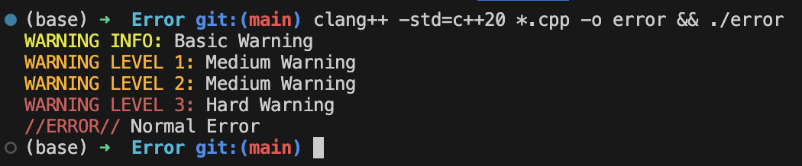
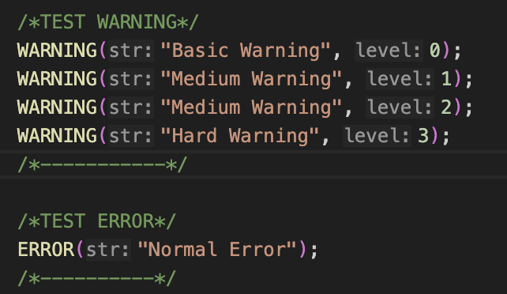

# Basic color error on Terminal v0.1

<dl>
  <dt> Easy to use :</dt> 
  <dd>import arror.hpp on your project... it's done !</dd>
</dl>

#### Actually, I'm working on this repo for the v1.0 big change...
